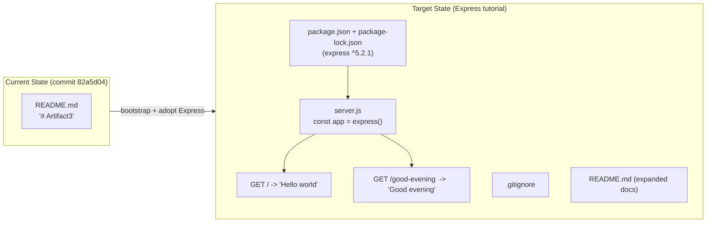
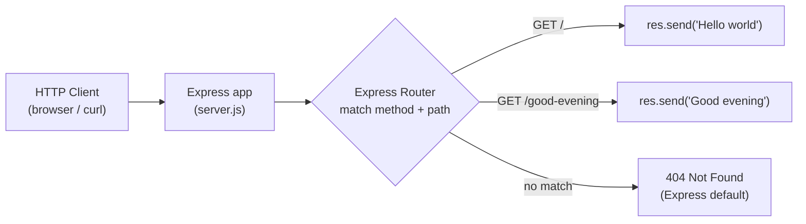
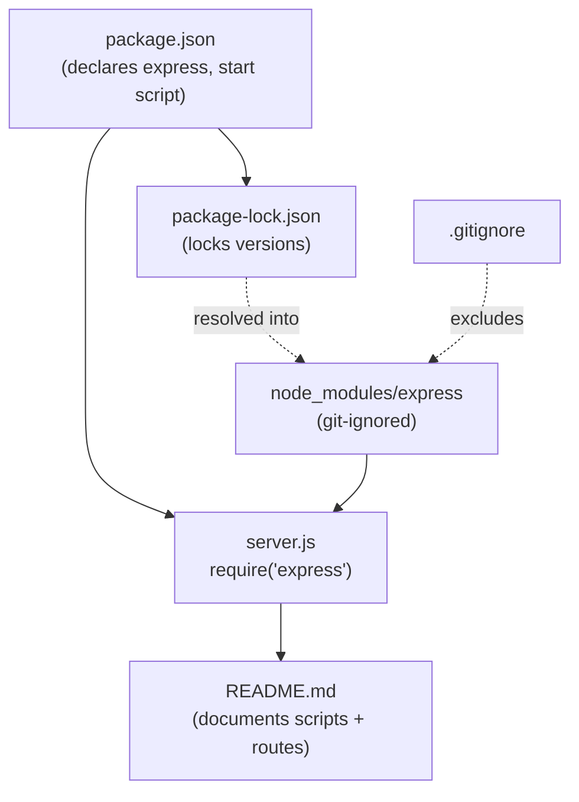

# Technical Specification

# 0. Agent Action Plan

## 0.1 Intent Clarification

This section restates the user's request in precise technical terms, records exactly what the Blitzy platform will build, and reconciles the request with the verified current state of the `Artifact3` repository. A central reconciliation point is established up front: the Node.js server the user describes as "existing" is not yet present in the repository, so this work realizes that server as part of adopting Express.js.

### 0.1.1 Core Refactoring Objective

Based on the prompt, the Blitzy platform understands that the refactoring objective is to **introduce the Express.js web framework into the `Artifact3` project and expose two HTTP `GET` endpoints**: the baseline endpoint that returns the exact plain-text body `Hello world`, and a new endpoint that returns the exact plain-text body `Good evening`.

- **Refactoring type:** Tech stack migration / framework adoption — move from the implicit native Node.js `http` approach to the Express.js framework. Because no server source exists in the repository yet, this is delivered as a greenfield bootstrap of the Express architecture rather than an in-place rewrite of legacy code.
- **Target repository:** Same repository (`Artifact3`) — no new-repository migration was requested.

The refactoring goals, restated with enhanced clarity, are:

- Add Express.js (`express` at `^5.2.1`) as the project's web-framework dependency, declared in a new `package.json` and pinned in a generated `package-lock.json`.
- Provide an Express application entry point (`server.js`) that creates an application instance and starts an HTTP listener.
- Preserve the baseline behavior by serving the exact response `Hello world` from a `GET` route.
- Add a second `GET` route that serves the exact response `Good evening`.
- Supply the minimal supporting files required for a standalone, runnable tutorial (a `.gitignore`, npm scripts, and README usage documentation).

The following requirements are implicit in the request and are surfaced here so they are not missed:

- The Express 5 line requires Node.js 18 or higher; a modern Active LTS runtime (Node.js 24 LTS) is the recommended baseline.
- npm is the package manager, and `node_modules/` must be excluded from version control.
- "Behavior preservation" reduces to reproducing the exact `Hello world` response string, because there is no pre-existing implementation to retain.
- The resulting public contract is two HTTP `GET` endpoints returning plain-text response bodies.

> **User Request (verbatim):** "this is a tutorial of node js server hosting one endpoint that returns the response 'Hello world'. Could you add expressjs into the project and add another endpoint that return the reponse of 'Good evening'?"

### 0.1.2 Technical Interpretation

This refactoring translates to the following technical transformation strategy: establish an Express-based HTTP server, register the baseline route, register the new route, and document how to install and run the result — all within the existing `Artifact3` repository.

> **Current Repository Reality (must-read):** The repository the user refers to as an "existing" Node.js server does not yet contain any server code. The repository root holds only `README.md`, whose entire content is the single line `# Artifact3` [README.md:L1], with no subdirectories, no `package.json`, and no source files of any kind [1.2 SYSTEM OVERVIEW §1.2.2.2] [1.2 SYSTEM OVERVIEW §1.2.2.3]; no framework artifacts are present, and a search for Express route files specifically returned none [3.3 FRAMEWORKS & LIBRARIES §3.3.1]. This baseline is documented at commit `82a5d04` ("Initial commit") on branch `main` [1.3 SCOPE §1.3.3]. Consequently, the `Hello world` endpoint is **materialized** as part of establishing the Express foundation rather than refactored from existing code, and there is no legacy `http`-module file to delete or rewrite.

The mapping from the current architecture to the target architecture is as follows:

| Concern | Current State (verified baseline) | Target State |
|---|---|---|
| Web framework | None [3.3 FRAMEWORKS & LIBRARIES §3.3.1] | Express.js `^5.2.1` |
| HTTP server | None — no source files [1.2 SYSTEM OVERVIEW §1.2.2.2] | Express app started with `app.listen()` |
| Endpoints | None | `GET /` → `Hello world`; `GET /good-evening` → `Good evening` |
| Dependency manifest | None — no `package.json` [1.2 SYSTEM OVERVIEW §1.2.2.3] | `package.json` + `package-lock.json` |
| Runtime | Unspecified (no `engines`/`.nvmrc`) | Node.js 24 LTS (Express 5 requires `>= 18`) |
| Documentation | `README.md` = `# Artifact3` [README.md:L1] | Expanded README with setup and endpoint docs |

The transformation rules that govern the work are:

- Map each described capability to an Express construct — a "Hello world" endpoint becomes `app.get('/', (req, res) => res.send('Hello world'))`, and a "Good evening" endpoint becomes `app.get('/good-evening', (req, res) => res.send('Good evening'))`.
- Use CommonJS modules (`require`) by default for tutorial simplicity; ECMAScript modules are an equivalent alternative only if `"type": "module"` is added to `package.json`.
- Externalize the listen port via `process.env.PORT || 3000` to follow twelve-factor configuration.
- Preserve the existing project identity — the `# Artifact3` title remains the first line of `README.md` [README.md:L1].

The essence of the entry point is captured by the following representative snippet:

```js
const app = require('express')();
app.get('/', (req, res) => res.send('Hello world'));
app.get('/good-evening', (req, res) => res.send('Good evening'));
```

Because the user specified response bodies but not routing details, the following assumptions are adopted as sensible defaults. They are recorded transparently so they can be overridden if the user clarifies otherwise; none of them block execution.

| Aspect | User Specified? | Assumed Value | Rationale |
|---|---|---|---|
| Baseline route path | No | `GET /` | Conventional tutorial root route |
| New route path | No | `GET /good-evening` | Slug derived from the "Good evening" response |
| Listen port | No | `3000` (override via `PORT` env var) | Common Express tutorial convention |
| Entry-point filename | No | `server.js` | Descriptive; referenced by `package.json` `main`/`start` |
| HTTP method | No | `GET` | Default for read-only text responses |

The end-to-end intent is summarized below:




## 0.2 Scope Boundaries

This section enumerates exactly which files are touched and which concerns are explicitly excluded. Because the repository is a single-file scaffold today [1.3 SCOPE §1.3.3], the in-scope set is small, fully enumerable, and almost entirely additive (one `CREATE` set plus a single `README.md` `UPDATE`).

### 0.2.1 Exhaustively In Scope

The complete set of files that will be created or modified, all within a single execution phase, is:

| File (repository path) | Transformation | Purpose |
|---|---|---|
| `package.json` | CREATE | Project manifest declaring `express` `^5.2.1`, a `start` script (`node server.js`), `main` = `server.js`, and `engines.node` `>= 18` |
| `package-lock.json` | CREATE | Lockfile generated by `npm install`, pinning `express` and its transitive dependencies to exact versions |
| `server.js` | CREATE | Express application entry point — instantiates the app, registers `GET /` (`Hello world`) and `GET /good-evening` (`Good evening`), and calls `app.listen()` |
| `.gitignore` | CREATE | Excludes `node_modules/`, `npm-debug.log*`, and `.env` from version control |
| `README.md` | UPDATE | Currently only the title `# Artifact3` [README.md:L1]; appended with description, prerequisites, install/run commands, and an endpoints table |
| `routes/index.js` | CREATE *(optional)* | An `express.Router()` module, included only if route modularization is desired; the default minimal design keeps both routes inline in `server.js` |

Regarding trailing-pattern coverage: the in-scope set is intentionally listed as explicit paths rather than wildcards because it is tiny and fully known. For completeness against the standard refactoring scope patterns, the equivalent trailing-pattern view is:

- `*.json` (root) — covers `package.json` and `package-lock.json`
- `server.js` (root) — the single source entry point (or `routes/**/*.js` if the optional router module is added)
- `.gitignore`, `README.md` (root) — configuration and documentation

**Rule-mandated files:** None. The user supplied no implementation rules (the rules input is empty), so there are no rule-mandated migration scripts, configuration files, or test fixtures to add to scope.

### 0.2.2 Explicitly Out of Scope

The following are explicitly out of scope. None were requested by the user, and all are absent from the baseline repository [1.3 SCOPE §1.3.2]:

| Out-of-Scope Item | Rationale |
|---|---|
| Frontend / user interface | Headless HTTP server; no UI exists or is requested [1.2 SYSTEM OVERVIEW §1.2.2.2] |
| Databases, persistence, or ORM | No data requirements in the request |
| Authentication / authorization | Not requested; endpoints return static public text |
| Automated test suite & test runner | Not requested and no existing tests; optional but excluded from this change |
| CI/CD pipelines (`.github/workflows/*`, `.gitlab-ci.yml`) | No delivery automation requested |
| Containerization (`Dockerfile`) / IaC / deployment manifests | Out of scope for a local tutorial |
| TypeScript, transpilers, or bundlers | The request is a plain-JavaScript Node tutorial |
| Additional endpoints beyond the two specified | Only `Hello world` and `Good evening` are requested |
| Custom middleware, body parsing, templating engines | Not needed for two static-text `GET` routes |
| Renaming the project identity `Artifact3` or rewriting git history | Identity is preserved [README.md:L1] |


## 0.3 Target Design

This section defines the target file and folder layout, the research that informs the technology choices, the design patterns that are appropriate at this scope, and the user-interface determination.

### 0.3.1 Refactored Structure Planning

The target is a standalone, runnable Node.js/Express tutorial inside the existing `Artifact3` repository. The complete layout is:

```
Artifact3/
├── .gitignore          # ignores node_modules/, npm-debug.log*, .env
├── package.json        # manifest: express ^5.2.1, start script, main, engines >=18
├── package-lock.json   # generated lockfile pinning express + transitive deps
├── server.js           # Express entry point: GET / and GET /good-evening + app.listen(PORT)
└── README.md           # UPDATED from "# Artifact3" to include setup & endpoint docs
```

An optional modularization variant (used only if route separation is desired) adds:

```
Artifact3/
└── routes/
    └── index.js        # express.Router() exporting the two routes, mounted via app.use('/', router)
```

Every file above is created new except `README.md`, which is updated in place; this reflects the empty baseline, in which no source, manifest, or configuration files exist [1.2 SYSTEM OVERVIEW §1.2.2.3]. The target runtime request flow is:



### 0.3.2 Web Search Research Conducted

Up-to-date research was performed to ground the technology and version choices (versions are time-sensitive and were verified rather than assumed):

- **Current Express version and minimum runtime** — the npm registry lists Express `5.2.1` as the latest stable release and states that Node.js 18 or higher is required (`npmjs.com/package/express`). This drives the `express ^5.2.1` dependency and the `engines.node >= 18` constraint.
- **Node.js LTS landscape (May 2026)** — Node.js 24 is the current Active LTS line (recommended default for new projects) while Node.js 22 is in Maintenance LTS (`nodejs.org` release schedule / `endoflife.date/nodejs`). This drives the Node.js 24 LTS recommendation.
- **Express 5 routing conventions and migration notes** — the official "Migrating to Express 5" guide (`expressjs.com/en/guide/migrating-5.html`) confirms that simple literal routes via `app.get(path, handler)` with `res.send()` are unchanged; the breaking changes (named wildcards such as `/*splat`, optional-parameter syntax `{/:id}`, removal of `app.del()`) do not apply to the two literal paths used here. It also notes that in Express 5 the `app.listen` callback receives errors as an argument rather than throwing.

### 0.3.3 Design Pattern Applications

The patterns applied are scoped to a two-route, static-text server — they are deliberately lightweight:

- **Single Express application instance (front controller):** one `const app = express()` acts as the central dispatcher for all incoming requests.
- **Routing pattern:** `app.get(path, handler)` declaratively maps an HTTP method and path to a handler function, keeping each endpoint's logic isolated.
- **Middleware pipeline (Express core):** the framework's request pipeline is available by default; no custom middleware is required for static-text responses.
- **Externalized configuration:** the listen port is read from `process.env.PORT` with a `3000` fallback, following twelve-factor configuration.
- **Optional modular routing:** `express.Router()` mounted with `app.use('/', router)` is documented as a scalability path, not used in the default minimal design.

To remain faithful to the actual scope, the following heavier patterns are **deliberately excluded** as over-engineering for a two-endpoint tutorial: the Repository pattern (no data access), a Service layer (no business logic), Dependency Injection (no collaborators to wire), and the Factory pattern (no object families to construct). They are noted here so their omission is an explicit, reasoned decision.

### 0.3.4 User Interface Design

User-interface design is **not applicable**. The target is a headless HTTP server that returns plain-text response bodies; there is no presentation layer, and the baseline confirms no UI artifacts exist [1.2 SYSTEM OVERVIEW §1.2.2.2]. Correspondingly, the Design System Compliance analysis is **not applicable** — the user specified no component library or design system, and there is no rendered interface to which design tokens or UI components could apply.


## 0.4 Transformation Mapping

This section provides the exhaustive source-to-target file mapping, the cross-file wiring between those files, and the wildcard/execution rules. Because the repository has no source files today [1.2 SYSTEM OVERVIEW §1.2.2.2], most targets have no equivalent source and are honestly marked as such rather than mapped to a fabricated origin.

### 0.4.1 File-by-File Transformation Plan

| Target File | Transformation | Source File | Key Changes |
|---|---|---|---|
| `package.json` | CREATE | (no equivalent source) | New manifest: `dependencies.express` = `^5.2.1`; `scripts.start` = `node server.js`; `main` = `server.js`; `engines.node` = `>= 18` |
| `package-lock.json` | CREATE | (generated by `npm install`) | Locks `express` and its transitive dependencies to exact versions |
| `server.js` | CREATE | (no equivalent source) | `require('express')`; `const app = express()`; `app.get('/', (req,res)=>res.send('Hello world'))`; `app.get('/good-evening', (req,res)=>res.send('Good evening'))`; `app.listen(process.env.PORT || 3000)` |
| `.gitignore` | CREATE | (no equivalent source) | Ignore `node_modules/`, `npm-debug.log*`, `.env` |
| `README.md` | UPDATE | `README.md` [README.md:L1] | Retain `# Artifact3` title; append description, prerequisites (Node `>= 18`), install (`npm install`), run (`npm start`), and an endpoints table (`GET /` → `Hello world`, `GET /good-evening` → `Good evening`) |
| `routes/index.js` | CREATE *(optional)* | (no equivalent source) | `express.Router()` defining the two routes; mounted via `app.use('/', router)` — only if the modular variant is chosen |

Every target except `README.md` has no equivalent source file because the repository is empty; `README.md` is its own source and is updated in place. There are no files to delete, because no legacy implementation exists.

### 0.4.2 Cross-File Dependencies

The created files form a small, well-defined dependency graph:

- `server.js` depends on the `express` package, resolved from `node_modules/` after installation. The new import statement is:

```js
const express = require('express');
```

- `package.json` declares the `express` dependency that `server.js` consumes, defines the `start` script that launches `server.js`, and sets `main` to `server.js`; `package-lock.json` locks the resolved versions.
- `README.md` documents the commands defined in `package.json` (`npm install`, `npm start`) and the routes defined in `server.js`.

Import statement changes follow the standard refactoring notation, adapted to a greenfield baseline:

- **FROM:** *(no pre-existing imports — the repository contains no source files [1.2 SYSTEM OVERVIEW §1.2.2.3])*
- **TO:** `const express = require('express');` introduced in `server.js`

The default module system is CommonJS (`require`). If ECMAScript modules are preferred, add `"type": "module"` to `package.json` and replace the statement with `import express from 'express';` — this is the only line affected by that choice.



### 0.4.3 Wildcard Patterns and One-Phase Execution

- **Wildcard patterns:** Not required. The in-scope set is small and fully enumerated (five files plus one optional file), so explicit paths are used instead of wildcards. Per the refactoring rules, only trailing wildcard patterns (for example, `routes/**/*.js`) would ever be used and never leading patterns; none are necessary here.
- **One-phase execution:** The entire change is executed by Blitzy in a single phase. All `CREATE` operations (`package.json`, `package-lock.json`, `server.js`, `.gitignore`) and the single `README.md` `UPDATE` occur together; the work is never split across multiple phases.


## 0.5 Dependency Inventory

This section records the exact packages and runtime involved in the refactor. All versions are verified against authoritative sources rather than left as placeholders, because the repository has no dependency manifest to read from [1.2 SYSTEM OVERVIEW §1.2.2.3].

### 0.5.1 Key Packages

| Registry | Name | Version | Purpose |
|---|---|---|---|
| npm (public) | `express` | `^5.2.1` | Web framework providing routing (`app.get`), the middleware pipeline, and `res.send` for the two text endpoints. Latest stable on npm. This is the only direct dependency. |
| nodejs.org (runtime) | `node` | 24.x LTS target (`>= 18` required by Express 5) | JavaScript runtime that executes `server.js` |
| npm (bundled with Node) | `npm` | 11.x | Installs dependencies and generates `package-lock.json` |

Express `5.2.1` brings its own transitive dependencies (its router, body-parser, and related internals), which npm installs automatically and pins in `package-lock.json`; they do not need to be declared directly. No private or internal packages are involved.

### 0.5.2 Dependency Updates and Import Refactoring

**Dependency changes** (the focus is on changes; nothing else exists to enumerate):

- **ADD (new direct dependency):** `express` `^5.2.1` — the single dependency addition.
- **REMOVE:** None — there are no prior dependencies, because no `package.json` existed at baseline [1.2 SYSTEM OVERVIEW §1.2.2.3].
- **UPDATE:** None — this is a greenfield bootstrap with no existing versions to bump.

**Import refactoring rules:**

- A new `require` is introduced in `server.js`: `const express = require('express');`.
- There are no pre-existing `import`/`require` statements anywhere in the repository to refactor, so there is no "old → new" import transformation set and no wildcard import-update sweep across the codebase.

**External reference updates:**

- Documentation: `README.md` documents `npm install`, `npm start`, and the two endpoints.
- Build / manifest: `package.json` declares `express`, the `start` script, and the `engines` constraint.
- No CI/CD files (`.github/workflows/*.yml`, `.gitlab-ci.yml`), and no `*.config.*` files exist or are introduced.


## 0.6 Refactoring Rules and Special Instructions

This section captures the rules and constraints that govern the change. The user supplied no explicit implementation rules (the rules input is empty), so the rules below are the standard, implicit constraints required to honor the request faithfully, followed by the special instructions and the additional analysis relevant to this refactor.

### 0.6.1 Refactoring-Specific Rules

- **Preserve baseline behavior exactly:** the baseline endpoint must return the exact body `Hello world` (byte-for-byte), reproduced as part of the Express bootstrap since no prior implementation exists.
- **Adopt Express cleanly:** Express must be a declared dependency in `package.json` and consumed via `require('express')`; the server must not fall back to the native `http` module for routing.
- **Both endpoints must be functional:** after `npm install` and `npm start`, `GET /` returns `Hello world` and `GET /good-evening` returns `Good evening`.
- **Keep the project runnable and self-contained:** the result must run locally with only `npm install` followed by `npm start`, with no additional manual setup.
- **Preserve project identity:** the `# Artifact3` title remains the first line of `README.md` [README.md:L1]; the change is additive documentation, not a rename.
- **No user-mandated rules exist:** there are no required design patterns, no mandated migration scripts, configuration files, or test fixtures imposed by user rules.

### 0.6.2 Special Instructions, Constraints, and Analysis

- **User examples (preserved verbatim):**
  - *User Example:* the existing endpoint returns the response `Hello world`.
  - *User Example:* the new endpoint returns the response `Good evening`.
  These strings must be reproduced exactly, without added punctuation, casing changes, or surrounding markup.
- **Baseline-reality constraint:** the most important special consideration is that the "existing" server the user references is not present in the repository — only `README.md` exists [README.md:L1] [1.2 SYSTEM OVERVIEW §1.2.2.2]. Downstream code generation must therefore create the foundational project files (manifest, entry point, ignore file) in addition to the two routes, rather than assuming a server is already in place.
- **Migration scope:** this is a same-repository change; there is no migration to a new repository.
- **Performance / scalability:** no performance or scalability targets were stated, and none are introduced; the design intentionally avoids premature abstraction (see the excluded patterns in 0.3.3).
- **Express 5 implementation notes (from research):** the two literal routes use the stable `app.get`/`res.send` API, which is unchanged in Express 5; the Express 5 breaking changes (named wildcards, optional-parameter syntax, removal of `app.del()`) do not apply. In Express 5, the `app.listen` callback receives any startup error as an argument rather than throwing, so the listener callback should handle that argument if one is provided.
- **Open assumption to confirm:** the new endpoint path `GET /good-evening` and the listen port `3000` are reasonable defaults chosen here (the user specified only the response bodies). They can be adjusted without altering the rest of the plan if the user prefers different values.


## 0.7 Attachments and References

**Attachments:** None. No files, images, PDFs, or Figma screens were provided with this request. Accordingly, there are no attachment filenames to summarize and no Figma frame names or URLs to list, and no design-to-system mapping is applicable.

**External references consulted** (for version and routing verification during planning):

- `npmjs.com/package/express` — Express latest stable version (`5.2.1`) and the Node.js `>= 18` requirement.
- `nodejs.org` release schedule and `endoflife.date/nodejs` — Node.js LTS status (Node.js 24 Active LTS as of May 2026).
- `expressjs.com/en/guide/migrating-5.html` — Express 5 routing conventions and migration notes.

**Repository and specification anchors cited in this plan:**

- `README.md` — the sole existing file, content `# Artifact3` [README.md:L1].
- Technical Specification §1.2 SYSTEM OVERVIEW, §1.3 SCOPE, and §3.3 FRAMEWORKS & LIBRARIES — corroborate the empty-baseline state at commit `82a5d04` [1.3 SCOPE §1.3.3].


