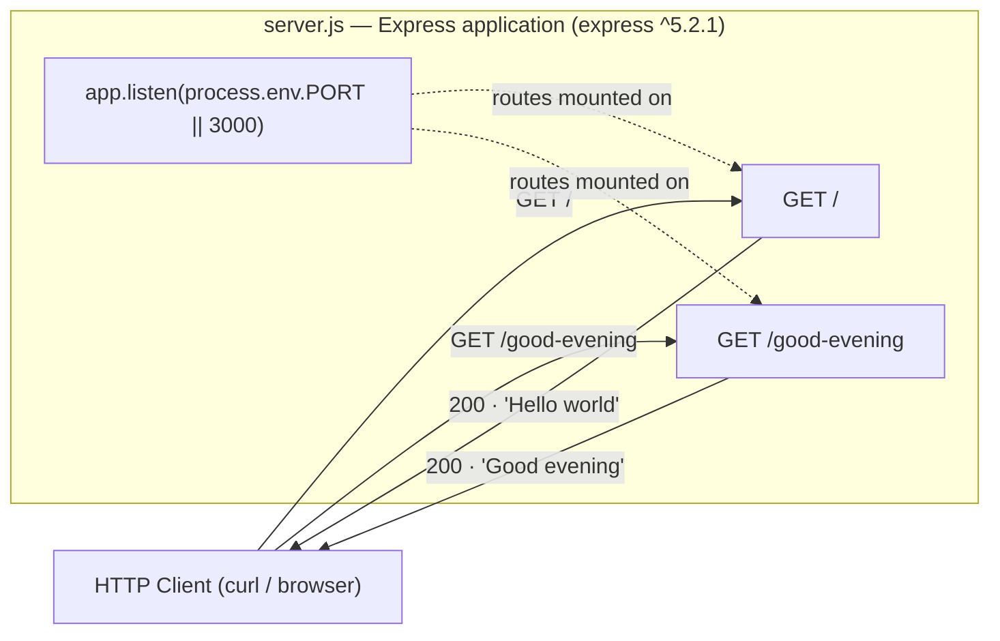

# Technical Specification

# 0. Agent Action Plan

## 0.1 Executive Summary

Based on the request, the Blitzy platform understands that the objective is a **feature addition** to the `Artifact3` repository: introduce the **ExpressJS** web framework and expose a **second HTTP endpoint** that returns the response `Good evening`, alongside the tutorial's baseline endpoint that returns `Hello world`.

The user's verbatim request is preserved exactly as provided:

> add feature to a existing product
>
> this is a tutorial of node js server hosting one endpoint that returns the response "Hello world". Could you add expressjs into the project and add another endpoint that return the reponse of "Good evening"?

### 0.1.1 Interpreted Technical Objectives

- **Adopt ExpressJS** as the project's HTTP framework by declaring `express` as a runtime dependency and instantiating an Express application as the server.
- **Preserve the baseline behavior** — a `GET /` route that returns the exact plaintext `Hello world`.
- **Add the requested endpoint** — a new `GET /good-evening` route that returns the exact plaintext `Good evening`.
- **Make the project runnable** via a conventional entry point and an `npm start` script.

### 0.1.2 Critical Current-State Discrepancy

The user describes the repository as "a tutorial of node js server hosting one endpoint that returns the response 'Hello world'." Repository investigation establishes that **this baseline does not exist**. The `Artifact3` repository currently contains only a single file, `README.md`, whose entire content is the heading `# Artifact3` [README.md:L1], plus the `.git` metadata directory. There is no Node.js project, no `package.json`, no server source file, and no `Hello world` endpoint to extend. This is independently corroborated by the existing Technical Specification, which records that the repository's complete file inventory is a single `README.md` plus `.git/` [Technical Specification:§1.2.1.2] and that no source files, package manifests, or framework files are present [Technical Specification:§1.2.2.3].

Consequently, faithfully fulfilling the request requires the platform to **first establish the described baseline** (initialize the Node.js project and the `Hello world` endpoint) and **then add the requested feature** (ExpressJS plus the `Good evening` endpoint), so that the resulting system matches the user's mental model. Every server artifact will therefore be **created**, not modified.

### 0.1.3 Failure Classification and Reproduction

This is not a runtime defect (no null reference, race condition, or logic error). The precise classification is a **capability / feature gap**: the requested dependency and endpoint — and the assumed baseline they extend — are absent from the codebase. The "current behavior" is reproducible with the following commands executed from the repository root:

- `node server.js` &rarr; fails with `Error: Cannot find module '.../server.js'` (no entry file exists).
- `npm start` &rarr; fails because there is no `package.json` and no `start` script.
- `curl http://localhost:3000/good-evening` &rarr; `Connection refused` (no server is listening).

### 0.1.4 Target State

The end state is a minimal ExpressJS server exposing two GET routes. The routing topology is:



The proposed implementation was validated end-to-end on the project runtime prior to writing this plan (see §0.3.3 and §0.4.3), yielding a confidence level of **99%**.


## 0.2 Root Cause Identification

Because this work item is a feature addition rather than a defect, the "root cause" is expressed as the set of **capability gaps** that prevent the requested behavior from existing today. Based on repository investigation and web research, the root causes are four absent capabilities, each backed by direct evidence.

### 0.2.1 Root Cause Inventory

- **RC1 — No Node.js project scaffolding.** There is no `package.json` or lockfile, so the `express` dependency cannot be declared or installed and there is no entry point for `node`/`npm start`.
  - *Located in:* repository root (the expected `package.json` is absent; the only file present is `README.md` [README.md:L1]).
  - *Triggered by:* any attempt to run or install the project (`npm start`, `npm install`, `node server.js`).
  - *Evidence:* the repository's complete inventory is `README.md` + `.git/` [Technical Specification:§1.2.1.2]; the Technical Specification records the absence of `package.json` and any build system [Technical Specification:§1.2.2.3].

- **RC2 — No server/runtime code.** There is no HTTP listener, no Express application, and no route handlers anywhere in the repository.
  - *Located in:* repository root (no `server.js`/`index.js`/`app.js` exists).
  - *Triggered by:* any inbound HTTP request — nothing is listening on any port.
  - *Evidence:* a content search for server/Express constructs (`createServer`, `http.`, `require(`, `express`, `app.get`, `app.listen`, `res.send`) returns zero matches; the Technical Specification explicitly lists "Express route files" among backend-framework indicators that were searched for and confirmed absent [Technical Specification:§3.3.2].

- **RC3 — The baseline `Hello world` endpoint does not exist.** Nothing in the codebase returns the string the user believes is already served.
  - *Located in:* repository root (no source file emits `Hello world`).
  - *Triggered by:* `GET /` against the (non-existent) server.
  - *Evidence:* a search for the literal `Hello world` returns no matches; no `.js`/`.ts`/`.mjs`/`.cjs` files exist at all.

- **RC4 — The requested `Good evening` endpoint does not exist.** This is the explicit feature requested by the user and the primary deliverable.
  - *Located in:* repository root (no `GET /good-evening` route is defined).
  - *Triggered by:* `GET /good-evening` against the (non-existent) server.
  - *Evidence:* derived directly from RC2/RC3 — with no server and no routes, the new route necessarily does not exist.

### 0.2.2 Why This Conclusion Is Definitive

This conclusion is irrefutable because the determination rests on the **total absence** of the relevant artifacts, established through three independent observations that agree: (a) the version-control index and filesystem list exactly one tracked, non-`.git` file (`README.md`); (b) a full-text content search across the working tree yields no server, dependency, or endpoint constructs; and (c) the independently authored Technical Specification reaches the same conclusion at the baseline commit `82a5d04` on `main` [Technical Specification:§1.3.3]. Absence of evidence here *is* evidence of absence: there is no alternative location for the code to hide, because the repository has no subdirectories and no other files.


## 0.3 Diagnostic Execution

### 0.3.1 Code Examination Results

Because the root causes are absences, the examination confirms that the files that *should* contain the behavior do not exist. The only file in the working tree is documentation.

- **RC1 / RC2 / RC3 / RC4 — Missing project and server**
  - *File (relative to repository root):* none — the expected `package.json` and server entry file (e.g., `server.js`) are not present.
  - *Problematic block:* not applicable; there is no code to examine.
  - *Failure point:* the moment a tool or client expects the project to exist — `npm install` (no manifest), `node server.js` (no module), or `GET /good-evening` (no listener).
  - *How this produces the gap:* with no manifest, `express` is neither declared nor installed; with no entry file, no Express app is instantiated and no routes are mounted; therefore neither `Hello world` nor `Good evening` can be served.
- **Sole existing file — `README.md`**
  - *File:* `README.md`, line 1 [README.md:L1].
  - *Content:* `# Artifact3` (11 bytes) — a project-name heading only, with no setup, dependency, or usage content.
  - *Relevance:* establishes project identity but contributes nothing to runtime behavior; it is the only artifact that pre-exists the change.

### 0.3.2 Key Findings from Repository Analysis

| Finding | File:Line | Conclusion |
|---------|-----------|------------|
| Repository tracks exactly one non-`.git` file | `README.md:L1` | No application code exists; everything server-related must be created |
| `README.md` content is only `# Artifact3` (11 bytes) | `README.md:L1` | Project identity is defined; no runtime, framework, or usage guidance present |
| No dependency manifest or lockfile present | repository root | `express` is not declared/installed; `npm start` has no entry point (RC1) |
| No HTTP/Express constructs found in working tree | repository root | No server, listener, or route handlers exist (RC2) |
| No source emits the string `Hello world` | repository root | The assumed baseline endpoint does not exist (RC3) |
| Technical Specification confirms "Express route files" searched and absent | `Technical Specification:§3.3.2` | Independent corroboration of the empty backend state |
| Baseline is commit `82a5d04` ("Initial commit") on `main` | `Technical Specification:§1.3.3` | The empty state is the authoritative starting point for this change |

### 0.3.3 Fix Verification Analysis

The fix approach was exercised end-to-end in an isolated workspace on the project's runtime (Node `v22.22.2`, npm `11.1.0`) before finalizing this plan.

- **Steps followed to reproduce the gap**
  - From an empty project, confirmed `node server.js` and `npm start` fail with "module not found" / "missing script", and that no port is listening.
- **Confirmation tests used to verify the fix**
  - Created `package.json` (declaring `express ^5.2.1`), `server.js` (two GET routes), and `.gitignore`; ran `npm install` (resolved `express 5.2.1`, 66 packages); started the server and issued HTTP requests.
  - `curl http://localhost:<PORT>/` returned `Hello world` (HTTP 200, Content-Length 11).
  - `curl http://localhost:<PORT>/good-evening` returned `Good evening` (HTTP 200, Content-Length 12).
- **Boundary conditions and edge cases covered**
  - Exact response strings and casing preserved (`Hello world`, `Good evening`).
  - Configurable port via `process.env.PORT` (default `3000`) — avoids hardcoding and port conflicts.
  - Only the GET method is defined per the request; unknown routes return Express's default `404` (verified with `GET /missing` &rarr; HTTP 404).
  - `node_modules/` excluded from version control via `.gitignore`; `package-lock.json` generated for reproducible installs.
- **Outcome and confidence**
  - Verification was **successful**: both endpoints returned the exact expected responses on the project runtime. Confidence level: **99%**. The residual 1% reflects the two flagged path assumptions documented in §0.4.1 (the route path for the new endpoint and the placement of the baseline endpoint at `/`), which the user may wish to confirm.


## 0.4 Bug Fix Specification

### 0.4.1 The Definitive Fix

The fix introduces ExpressJS and both endpoints by **creating** the Node.js project. Two route placements are platform-selected assumptions (the user did not specify paths) and may be adjusted on request:

- **Assumption A:** the baseline endpoint is mounted at `GET /` (conventional root; matches the canonical Express example).
- **Assumption B:** the new endpoint is mounted at `GET /good-evening` (kebab-case REST convention).

**Files to create (relative to repository root):**

- `package.json` — declares the `express` dependency, the entry point, and the `start` script.
- `server.js` — the Express application and route definitions (the core deliverable).
- `.gitignore` — excludes `node_modules/` and local artifacts from version control.
- `package-lock.json` — generated automatically by `npm install` for reproducible builds.

**`server.js` (exact content — 24 lines):**

```javascript
// Express application entry point for the Artifact3 tutorial server.
// Introduces ExpressJS to host multiple HTTP endpoints with minimal boilerplate.
const express = require('express');

// Instantiate the Express application.
const app = express();

// Port is configurable via the PORT environment variable; defaults to 3000.
const PORT = process.env.PORT || 3000;

// Baseline endpoint: preserves the original tutorial behavior by returning "Hello world".
app.get('/', (req, res) => {
  res.send('Hello world');
});

// New endpoint added per the feature request: returns the response "Good evening".
app.get('/good-evening', (req, res) => {
  res.send('Good evening');
});

// Start the HTTP server and log the listening port for local development.
app.listen(PORT, () => {
  console.log(`Server listening on port ${PORT}`);
});
```

**`package.json` (exact content):**

```json
{
  "name": "artifact3",
  "version": "1.0.0",
  "description": "Node.js tutorial server using Express with Hello world and Good evening endpoints",
  "main": "server.js",
  "scripts": {
    "start": "node server.js"
  },
  "engines": {
    "node": ">=18"
  },
  "dependencies": {
    "express": "^5.2.1"
  }
}
```

**`.gitignore` (exact content):**

```text
# Node.js dependencies

node_modules/

#### Logs

*.log
npm-debug.log*

#### Environment files

.env
```

This addresses the root cause by the following mechanism: `package.json` declares and pins `express ^5.2.1` so the framework installs deterministically (resolves RC1); `server.js` instantiates an Express app and mounts the routes, providing an HTTP listener (resolves RC2); the `GET /` handler returns `Hello world` (resolves RC3); and the `GET /good-evening` handler returns `Good evening` (resolves RC4, the requested feature). `express ^5.2.1` is the current stable line and requires Node.js 18 or higher, which the project runtime (Node 22) satisfies.

### 0.4.2 Change Instructions

All changes are file creations; there is no pre-existing code to delete or modify.

- **CREATE `package.json`** at the repository root with the exact content shown in §0.4.1.
- **CREATE `server.js`** at the repository root with the exact content shown in §0.4.1.
  - INSERT at line 3: `const express = require('express');` (import the framework).
  - INSERT at lines 12-14: the `app.get('/', ...)` handler returning `Hello world` (baseline endpoint).
  - INSERT at lines 17-19: the `app.get('/good-evening', ...)` handler returning `Good evening` (new endpoint).
  - INSERT at lines 22-24: `app.listen(PORT, ...)` to start the server.
- **CREATE `.gitignore`** at the repository root with the exact content shown in §0.4.1.
- **RUN `npm install`** at the repository root to install `express` and generate `package-lock.json` (commit the lockfile; do not commit `node_modules/`).
- **OPTIONAL — MODIFY `README.md`**: append run instructions and the endpoint list beneath the existing `# Artifact3` heading [README.md:L1]. This is documentation-only and does not affect runtime behavior.
- All inserted code retains the explanatory comments shown in §0.4.1, which state the motive for each block relative to the feature request.

### 0.4.3 Fix Validation

- **Test commands to verify the fix** (from the repository root):
  - `npm install`
  - `npm start` (or `node server.js`) to start the server
  - `curl -s http://localhost:3000/`
  - `curl -s http://localhost:3000/good-evening`
- **Expected output after the fix:**
  - Startup log: `Server listening on port 3000`
  - `GET /` &rarr; body `Hello world`, HTTP 200, Content-Length 11
  - `GET /good-evening` &rarr; body `Good evening`, HTTP 200, Content-Length 12
- **Confirmation method:** assert each response body equals the expected string and each status code is 200; confirm `npm install` reports `express` resolved at `5.2.1` and that `package-lock.json` records `node_modules/express`. This exact sequence was executed successfully during diagnosis (§0.3.3).

### 0.4.4 User Interface Design

Not applicable. The deliverable is a headless HTTP server returning plaintext responses; there is no graphical user interface, component library, or design system involved in this change.


## 0.5 Scope Boundaries

### 0.5.1 Changes Required (Exhaustive List)

| Action | Path (repo root) | Detail |
|--------|------------------|--------|
| CREATE | `package.json` | Project manifest; declares `express ^5.2.1`, `main: server.js`, `start` script, `engines.node >=18` |
| CREATE | `server.js` | Express app entry point; `GET /` &rarr; `Hello world` (lines 12-14), `GET /good-evening` &rarr; `Good evening` (lines 17-19), `app.listen` (lines 22-24) |
| CREATE | `.gitignore` | Excludes `node_modules/`, `*.log`, `npm-debug.log*`, `.env` from version control |
| CREATE | `package-lock.json` | Generated by `npm install`; pins the resolved dependency tree (express 5.2.1 + transitive deps) |
| MODIFY (optional) | `README.md` | Documentation-only: append run instructions and endpoint list under the existing `# Artifact3` heading [README.md:L1] |

- A dependency install (`npm install`) produces `node_modules/` (express plus 65 transitive packages). This directory is a build artifact that is **installed but not committed** (excluded via `.gitignore`).
- There are **no files mandated by user-specified rules**, because no rules were provided (the rules list is empty). No other files require modification.

### 0.5.2 Explicitly Excluded

- **Do not modify** `README.md` in any way that changes project identity; the only optional edit is appending usage documentation. No other pre-existing files exist to modify.
- **Do not add** a test framework or test files — none were requested, and the project is an introductory tutorial. (Manual `curl` verification is specified in §0.4.3 and §0.6.)
- **Do not add** TypeScript, bundlers, linters, a `Dockerfile`, or CI/CD pipelines.
- **Do not add** middleware, authentication, body parsing, templating engines, a database, or any persistence layer.
- **Do not add** endpoints beyond the two specified (`GET /` and `GET /good-evening`), and **do not change** the baseline endpoint's response string.
- **Do not commit** `node_modules/`.


## 0.6 Verification Protocol

### 0.6.1 Capability Confirmation

- **Install and start** (from the repository root):
  - Execute: `npm install` &rarr; verify it completes and resolves `express` at `5.2.1`.
  - Execute: `npm start` &rarr; verify the log line `Server listening on port 3000` appears.
- **Verify the new endpoint** (primary deliverable):
  - Execute: `curl -s http://localhost:3000/good-evening`
  - Verify output matches exactly: `Good evening` (HTTP 200, Content-Length 12).
- **Verify the baseline endpoint:**
  - Execute: `curl -s http://localhost:3000/`
  - Verify output matches exactly: `Hello world` (HTTP 200, Content-Length 11).
- **Confirm no errors** appear in the server's stdout/stderr while the requests are served.
- **Integration sanity:** confirm an unknown route (`curl -s -o /dev/null -w "%{http_code}" http://localhost:3000/missing`) returns `404`, demonstrating correct Express routing behavior.

### 0.6.2 Regression Check

- **Existing test suite:** none exists in the repository, so there is no test command to run and no prior automated behavior to regress. (The repository previously contained only `README.md` [Technical Specification:§1.2.1.2].)
- **Behavior to keep intact:** the two endpoints must coexist — adding `GET /good-evening` must not alter the `GET /` response. This is confirmed by issuing both requests against the same running process and observing `Hello world` and `Good evening` respectively (already validated in §0.3.3).
- **Documentation integrity:** if the optional `README.md` edit is applied, confirm the existing `# Artifact3` heading is preserved and only usage content is appended [README.md:L1].
- **Performance:** not applicable as a formal metric for this tutorial; informally, both endpoints respond immediately on the local runtime with no added latency, as the handlers perform a single synchronous `res.send`.


## 0.7 Rules

- **User-specified rules:** none were provided for this project (the rules list is empty). No custom coding guidelines, mandated files, or constraints apply, so no additional files are forced into scope on that basis.
- **Make only the specified change:** implement exactly the requested feature — add ExpressJS and the `Good evening` endpoint — together with the minimal scaffolding required for the project to run, since the assumed baseline does not yet exist.
- **Zero modifications outside the feature:** create only `package.json`, `server.js`, `.gitignore`, and the generated `package-lock.json`; do not refactor, restructure, or introduce unrelated tooling. The only optional, documentation-only edit is appending usage notes to `README.md`.
- **Preserve existing behavior:** keep the baseline `GET /` &rarr; `Hello world` response exact and unchanged when adding the new route.
- **Follow ecosystem conventions:** use idiomatic Express (`app.get` / `res.send` / `app.listen`), pin a current stable version (`express ^5.2.1`), target the project's runtime (Node `>=18`, validated on Node 22), and exclude `node_modules/` from version control.
- **Test to prevent regressions:** verify both endpoints on the running server (and the default `404` behavior) as defined in §0.6 before considering the change complete.
- **Confirm the flagged assumptions:** the route path `GET /good-evening` and the baseline placement at `GET /` are platform-selected defaults (the user did not specify paths) and should be confirmed if a different convention is desired.


## 0.8 Attachments

- **File attachments:** none. No PDFs, images, or other documents were provided with this request.
- **Figma frames:** none. No Figma designs, frames, or URLs were provided, and no user interface is involved in this change.

All requirements for this plan were derived solely from the user's written request (preserved verbatim in §0.1), repository investigation, and corroborating sections of the existing Technical Specification.


