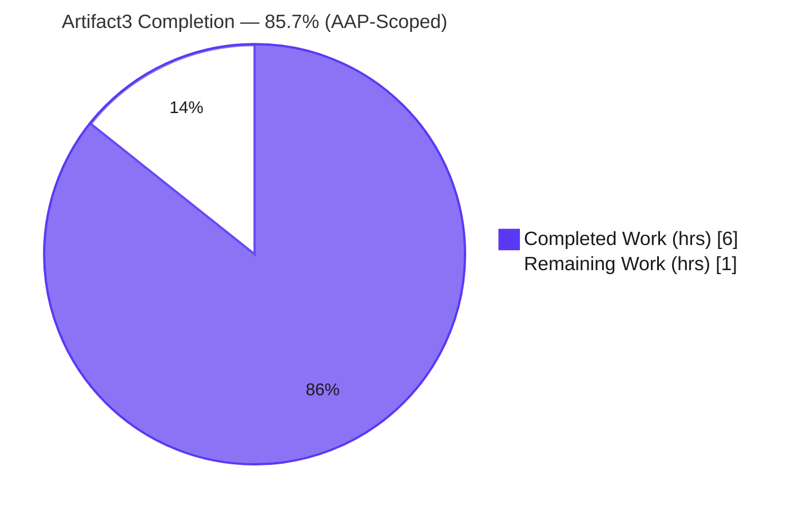
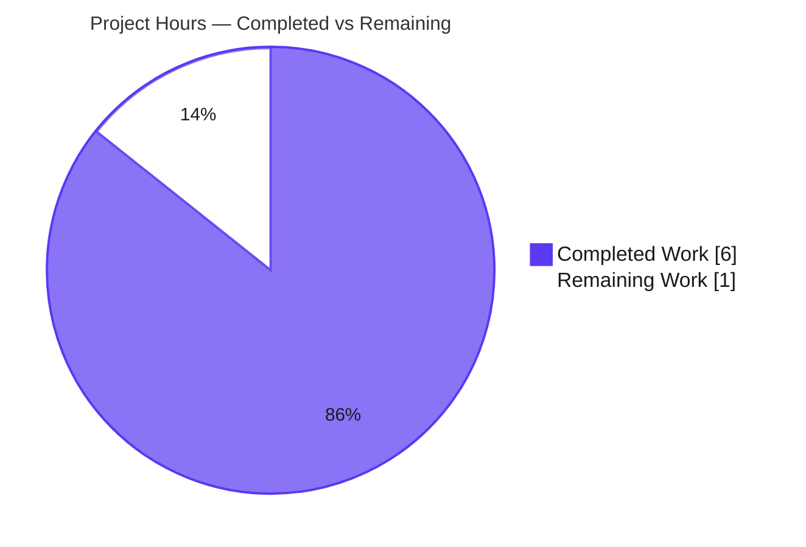

# Blitzy Project Guide — Artifact3 ExpressJS Server

> **Brand legend:** ▰ **Completed / AI Work** = Dark Blue `#5B39F3` · ▱ **Remaining / Not Completed** = White `#FFFFFF` · Headings/Accents = Violet-Black `#B23AF2` · Highlight = Mint `#A8FDD9`

---

## 1. Executive Summary

### 1.1 Project Overview

Artifact3 is a minimal Node.js HTTP tutorial server. This work item introduces the **ExpressJS** framework and adds a second endpoint — `GET /good-evening` returning `Good evening` — alongside the baseline `GET /` returning `Hello world`. Because repository investigation found the described baseline did not actually exist (only `README.md` was present), the change both **establishes the baseline** (Node.js project + `Hello world` route) and **delivers the requested feature** (ExpressJS + `Good evening` route). Target users are developers learning Express routing; the business impact is a runnable, conventional Express reference project. Technical scope is four created files plus an optional README update — no database, UI, or external integrations.

### 1.2 Completion Status



| Metric | Hours |
| --- | --- |
| **Total Hours** | **7.0** |
| Completed Hours (AI + Manual) | 6.0 |
| Remaining Hours | 1.0 |
| **Percent Complete** | **85.7%** |

> **Formula:** Completion % = Completed ÷ Total = 6.0 ÷ 7.0 = **85.7%**. All completed hours were delivered autonomously by Blitzy agents (AI); 0 manual hours to date.
>
> **Reconciliation:** All AAP *code* deliverables are 100% complete and production-ready (every validation gate passed). The 85.7% reflects ~1.0h of remaining **human governance** — confirming two platform-selected route paths and the standard PR review/merge. There is **zero remaining engineering/code work**.

### 1.3 Key Accomplishments

- ✅ **ExpressJS adopted** — `express ^5.2.1` declared and installed (resolves to 5.2.1; verified via `X-Powered-By: Express`).
- ✅ **Primary deliverable** — `GET /good-evening` → `Good evening` (HTTP 200, Content-Length 12).
- ✅ **Baseline established & preserved** — `GET /` → `Hello world` (HTTP 200, Content-Length 11).
- ✅ **Runnable project** — `npm start` launches the server (`Server listening on port 3000`); port configurable via `PORT`.
- ✅ **Reproducible installs** — `package-lock.json` (lockfileVersion 3) committed; `npm ci` verified in a clean directory; **0 vulnerabilities** across 67 packages.
- ✅ **Clean repository hygiene** — `node_modules/` git-ignored (not committed); working tree clean; no stubs/TODOs/placeholders.
- ✅ **Documentation** — `README.md` updated with Usage, Endpoints table, and Example Requests; original `# Artifact3` heading preserved.

### 1.4 Critical Unresolved Issues

| Issue | Impact | Owner | ETA |
| --- | --- | --- | --- |
| Route paths `/` and `/good-evening` are platform-selected defaults (request did not specify paths) | Low — routing convention only; both endpoints function correctly as-is | Requester / Reviewer | < 0.5h |

> No compilation, dependency, or runtime blockers exist. The single item above is a **confirmation**, not a defect.

### 1.5 Access Issues

**No access issues identified.** The repository was fully accessible; `npm install` completed without credentials or private registries; no external services, API keys, or third-party accounts are required. `npm audit` reported 0 vulnerabilities.

| System/Resource | Type of Access | Issue Description | Resolution Status | Owner |
| --- | --- | --- | --- | --- |
| — | — | None | N/A | — |

### 1.6 Recommended Next Steps

1. **[High]** Confirm the two route paths (`GET /`, `GET /good-evening`) match the desired convention, or request alternates.
2. **[High]** Perform final code review of the 5-file diff and **merge** the branch to `main`.
3. **[Low]** *(Optional, beyond AAP §0.5.2)* Add an automated test suite (Jest + Supertest) for regression safety.
4. **[Low]** *(Optional, beyond AAP)* Add a CI smoke check and, if the server will be hosted, a process manager + `/health` endpoint.

---

## 2. Project Hours Breakdown

### 2.1 Completed Work Detail

| Component | Hours | Description |
| --- | --- | --- |
| Repository investigation & root-cause analysis | 0.5 | Confirmed baseline absent (RC1–RC4); established that all server artifacts must be created. |
| Node.js project manifest — `package.json` | 0.5 | `express ^5.2.1`, `main: server.js`, `start` script, `engines.node >=18`. |
| Express application bootstrap — `server.js` | 1.0 | `require('express')`, app instantiation, configurable `PORT`, `app.listen` + startup log. |
| Baseline route `GET /` → `Hello world` | 0.5 | Preserves original tutorial behavior (HTTP 200, CL 11). |
| Feature route `GET /good-evening` → `Good evening` | 0.5 | **Primary deliverable** (HTTP 200, CL 12). |
| ExpressJS dependency resolution & lockfile | 0.5 | `npm install` → express 5.2.1; `package-lock.json` (v3); `node_modules/` git-ignored. |
| `.gitignore` configuration | 0.25 | Excludes `node_modules/`, `*.log`, `npm-debug.log*`, `.env`. |
| `README.md` usage documentation | 1.0 | Requirements, Usage, Endpoints table, Examples; heading preserved (incl. checkpoint-review revision). |
| Behavioral verification & multi-gate validation | 1.25 | curl endpoints, 404, custom `PORT`, `X-Powered-By`, `npm ci` consistency, `npm audit`, `node --check`. |
| **Total Completed** | **6.0** | Matches Completed Hours in §1.2. |

### 2.2 Remaining Work Detail

| Category | Hours | Priority |
| --- | --- | --- |
| Confirm flagged route-path assumptions with requester (AAP §0.4.1/§0.7) | 0.5 | Medium |
| Final human code review & PR merge (path-to-production) | 0.5 | Medium |
| **Total Remaining** | **1.0** | Matches Remaining Hours in §1.2 and §7 pie chart |

> *Optional, beyond AAP §0.5.2 (excluded scope — **0h** toward completion): automated tests (~2–4h), CI workflow (~1–2h), containerization + process manager + `/health` (~2–4h), request logging (~0.5–1h). These do not affect the 85.7% figure.*

### 2.3 Hours Reconciliation

- **§2.1 Completed (6.0h) + §2.2 Remaining (1.0h) = 7.0h Total** (matches §1.2). ✔
- **Remaining 1.0h is identical** across §1.2, §2.2, and the §7 pie chart. ✔
- Completion % = 6.0 ÷ 7.0 = **85.7%** (consistent across §1.2, §7, §8). ✔

---

## 3. Test Results

All entries below originate from **Blitzy's autonomous validation logs** (5-gate production-readiness run) and were independently re-verified during this assessment. No automated unit/integration test framework exists — it is **intentionally out of scope** per AAP §0.5.2 (introductory tutorial; behavioral verification is curl-based per AAP §0.6).

| Test Category | Framework / Method | Total | Passed | Failed | Coverage % | Notes |
| --- | --- | --- | --- | --- | --- | --- |
| Runtime / Behavioral (HTTP) | Manual `curl` (Gate 2) | 5 | 5 | 0 | N/A | `GET /`, `GET /good-evening`, `GET /missing`→404, `X-Powered-By` header, `PORT=8080` |
| Dependency / Lockfile | `npm install` · `npm ci` · `npm ls` (Gate 1) | 3 | 3 | 0 | N/A | Clean install; lockfile consistency in fresh dir; sole top-level dep `express@5.2.1` |
| Static / Syntax | `node --check` · JSON parse (Gate 3) | 3 | 3 | 0 | N/A | `server.js` syntax valid; `package.json` & `package-lock.json` valid JSON |
| Security Audit | `npm audit` (Gate 1) | 1 | 1 | 0 | N/A | 0 vulnerabilities across 67 packages |
| Unit / Integration (automated) | None — excluded by AAP §0.5.2 | 0 | 0 | 0 | N/A | Intentionally out of scope (tutorial) |
| **Total** | — | **12** | **12** | **0** | **N/A** | 100% pass; no instrumented coverage (no automated suite) |

---

## 4. Runtime Validation & UI Verification

**Status legend:** ✅ Operational · ⚠ Partial · ❌ Failing

**Runtime health**
- ✅ **Server boot** — `npm start` logs `Server listening on port 3000`; clean stdout/stderr.
- ✅ **Baseline endpoint** — `GET /` → `Hello world` (HTTP 200, Content-Length 11).
- ✅ **Feature endpoint** — `GET /good-evening` → `Good evening` (HTTP 200, Content-Length 12).
- ✅ **Default routing** — `GET /missing` → HTTP 404 (Express default).
- ✅ **Framework confirmation** — response header `X-Powered-By: Express`.
- ✅ **Configurable port** — `PORT=8080 npm start` → `Server listening on port 8080`; endpoints serve correctly.
- ✅ **Lifecycle** — starts and stops cleanly by PID; no lingering processes; ports released.

**API integration**
- ✅ No external/3rd-party integrations in scope — none to validate.

**UI verification**
- ⚠ **N/A** — Per AAP §0.4.4 this is a **headless plaintext HTTP server**; there is no graphical UI, component library, or design system to verify.

---

## 5. Compliance & Quality Review

AAP deliverables cross-mapped to Blitzy quality/compliance benchmarks. **Fixes applied during autonomous validation: none required** — every file arrived correct, complete, and production-ready. The only process action was terminating orphaned background `node` processes from intermediate validation runs (by exact PID) to leave a clean environment.

| Benchmark / AAP Deliverable | Status | Progress | Notes |
| --- | --- | --- | --- |
| RC1 — Node.js scaffolding (`package.json`) | ✅ Pass | 100% | Matches AAP §0.4.1 exactly |
| RC2 — Express app + HTTP listener (`server.js`) | ✅ Pass | 100% | `app.listen` on `process.env.PORT||3000` |
| RC3 — `GET /` → `Hello world` | ✅ Pass | 100% | Verified (200, CL 11) |
| RC4 — `GET /good-evening` → `Good evening` | ✅ Pass | 100% | Verified (200, CL 12) — primary deliverable |
| ExpressJS adoption (`express ^5.2.1`) | ✅ Pass | 100% | Resolves to 5.2.1; `X-Powered-By: Express` |
| `.gitignore` excludes `node_modules/` etc. | ✅ Pass | 100% | Matches AAP §0.4.1 |
| `package-lock.json` reproducibility | ✅ Pass | 100% | lockfileVersion 3; `npm ci` passes in clean dir |
| `node_modules/` not committed | ✅ Pass | 100% | Git-ignored; 5 tracked files only |
| Baseline response unchanged | ✅ Pass | 100% | `Hello world` preserved when adding new route |
| README heading preserved | ✅ Pass | 100% | `# Artifact3` retained on line 1 |
| Zero placeholders / TODOs / stubs | ✅ Pass | 100% | Confirmed across all files |
| Dependency security | ✅ Pass | 100% | `npm audit` → 0 vulnerabilities |
| Ecosystem conventions (`app.get`/`res.send`/`app.listen`) | ✅ Pass | 100% | Idiomatic Express; Node `>=18` targeted |
| Confirm flagged route-path assumptions | ⚠ Pending | 0% | Human task (R13) — see §2.2 |

---

## 6. Risk Assessment

All risks are **Low severity** given the minimal, fully-validated tutorial scope. Only one risk is **Open** (the flagged route-path assumptions), which maps directly to the remaining human task.

| Risk | Category | Severity | Probability | Mitigation | Status |
| --- | --- | --- | --- | --- | --- |
| No automated test suite (manual `curl` only) | Technical | Low | Low | Behavioral verification performed; AAP §0.5.2 excludes tests; add Jest+Supertest if regression safety desired | Accepted (per scope) |
| Express 5.x is a relatively new major line (stable since Oct 2024) | Technical | Low | Low | App uses only `app.get`/`res.send`/`app.listen` (unaffected by v5 breaking changes); `^5.2.1` reverted the erroneous 5.2.0 query-parser change; 0 vulns | Mitigated |
| No TLS/HTTPS, auth, or rate-limiting | Security | Low | Low | Tutorial scope; plaintext public responses; no sensitive data; front with reverse proxy/TLS if ever exposed | Accepted (per scope) |
| Dependency supply chain (66 transitive packages) | Security | Low | Low | `package-lock.json` pins exact tree; `npm audit` 0 vulnerabilities; `npm ci` reproducible | Mitigated |
| No process manager / auto-restart / `/health` endpoint | Operational | Low | Low | Single-process tutorial; add pm2/systemd + `/health` if deployed | Accepted (per scope) |
| Minimal logging (startup line only) | Operational | Low | Low | Add `morgan`/structured logging if operationalized | Accepted (per scope) |
| Route-path assumptions are platform defaults, not user-confirmed | Integration | Low | Medium | Confirm with requester (remaining task R13) | **Open** |
| Default port 3000 conflict | Integration | Low | Low | Configurable via `PORT` env var (verified `PORT=8080`) | Mitigated |

---

## 7. Visual Project Status

**Project hours breakdown** (Completed = Dark Blue `#5B39F3`, Remaining = White `#FFFFFF`):



**Remaining hours by category** (from §2.2 — both Medium priority, 0.5h each):

| Category | Hours | Priority |
| --- | --- | --- |
| Confirm route-path assumptions | 0.5 | Medium |
| Code review & PR merge | 0.5 | Medium |
| **Total Remaining** | **1.0** | — |

> **Integrity:** "Remaining Work" in the pie chart (1.0) equals §1.2 Remaining Hours (1.0) and the §2.2 Hours sum (1.0). ✔

---

## 8. Summary & Recommendations

**Achievements.** The project is **85.7% complete** (6.0 of 7.0 hours). Every AAP-scoped engineering deliverable is finished, validated, and production-ready: ExpressJS is adopted (`express` 5.2.1), the baseline `GET /` → `Hello world` is established and preserved, and the requested `GET /good-evening` → `Good evening` endpoint is delivered. The project is runnable via `npm start`, installs reproducibly, and reports **0 vulnerabilities**. All five autonomous validation gates passed, independently re-verified during this assessment.

**Remaining gaps.** The remaining **1.0 hour** is purely **human governance** — there is no outstanding code work. It comprises (1) confirming the two platform-selected route paths and (2) a standard code review and merge. The route-path assumptions are the only Open risk and the only item that prevented reporting closer to the 99% cap.

**Critical path to production.** Confirm route paths → review the 5-file diff → merge to `main`. The server is then immediately runnable per the Development Guide (§9).

**Success metrics (all met).** Both endpoints return exact expected strings with correct status codes and content lengths; `X-Powered-By: Express` confirms the framework; lockfile is reproducible; repository hygiene is clean (5 tracked files, `node_modules/` ignored).

**Production-readiness assessment.** **Ready** for the intended purpose (a runnable Express tutorial). Tests, CI/CD, and containerization were intentionally excluded by AAP §0.5.2 and are offered only as optional future enhancements that do not affect the completion figure. **Confidence: High** — scope is small, well-defined, and fully verified.

| Metric | Value |
| --- | --- |
| Completion | 85.7% |
| Completed / Total Hours | 6.0 / 7.0 |
| Remaining Hours (human governance) | 1.0 |
| Remaining code work | 0.0 |
| Open risks | 1 (Low severity) |
| Vulnerabilities | 0 |

---

## 9. Development Guide

> All commands are copy-pasteable and were executed successfully during this assessment (Node `v20.20.2`, npm `11.1.0`). Run from the repository root.

### 9.1 System Prerequisites
- **Node.js ≥ 18** (verified on v20.20.2) — required by `engines.node` and Express 5.
- **npm** (bundled with Node; verified 11.1.0).
- **curl** — for endpoint verification (optional).
- **OS / hardware** — any platform; negligible resources (single minimal process). No database, cache, or message queue.

### 9.2 Environment Setup
- No virtual environment required (Node project).
- **No mandatory environment variables.** Optional: `PORT` (defaults to `3000`).
- ⚠ `.env` is git-ignored but **not auto-loaded** (no `dotenv` dependency) — set variables in the shell, e.g. `PORT=8080 npm start`.

### 9.3 Dependency Installation
```bash
npm install        # installs express ^5.2.1; expected: "found 0 vulnerabilities"
# For an exact, reproducible install from the lockfile:
npm ci
```
Verify the dependency tree:
```bash
npm ls --depth=0
# Expected:
# artifact3@1.0.0 <path>
# └── express@5.2.1
```

### 9.4 Application Startup
```bash
npm start          # equivalent to: node server.js
# Expected log:
# Server listening on port 3000
```

### 9.5 Verification Steps
```bash
curl -s http://localhost:3000/                 # -> Hello world          (HTTP 200, Content-Length 11)
curl -s http://localhost:3000/good-evening     # -> Good evening         (HTTP 200, Content-Length 12)
curl -s -o /dev/null -w "%{http_code}\n" http://localhost:3000/missing   # -> 404

# Confirm ExpressJS is serving:
curl -s -D - -o /dev/null http://localhost:3000/ | grep -i "x-powered-by"   # -> X-Powered-By: Express
```

### 9.6 Example Usage
```bash
# Custom port:
PORT=8080 npm start
curl -s http://localhost:8080/                 # -> Hello world

# Or open in a browser:
#   http://localhost:3000/
#   http://localhost:3000/good-evening
```

### 9.7 Troubleshooting

| Symptom | Cause | Resolution |
| --- | --- | --- |
| `EADDRINUSE` / port 3000 busy | Another process is using the port | `PORT=8080 npm start` (or free the port) |
| `Error: Cannot find module 'express'` | Dependencies not installed | Run `npm install` first |
| `SyntaxError` / engine warning on start | Node version < 18 | Upgrade Node (`node --version` ≥ 18) |
| `node: command not found` | Node.js not installed / not on PATH | Install from https://nodejs.org |
| Server won't stop | Running in background | Press `Ctrl+C` (foreground) or `kill <PID>` |

---

## 10. Appendices

### A. Command Reference

| Command | Purpose |
| --- | --- |
| `npm install` | Install dependencies (express ^5.2.1) |
| `npm ci` | Reproducible install from lockfile |
| `npm start` | Start the server (`node server.js`) |
| `npm ls --depth=0` | Show top-level dependency tree |
| `node --check server.js` | Validate JS syntax (no execution) |
| `npm audit` | Security audit of dependencies |
| `curl http://localhost:3000/` | Test baseline endpoint |
| `curl http://localhost:3000/good-evening` | Test feature endpoint |

### B. Port Reference

| Port | Service | Notes |
| --- | --- | --- |
| 3000 | Express HTTP server (default) | Override with `PORT` env var |
| 8080 | Express HTTP server (example custom) | Set via `PORT=8080` |

### C. Key File Locations

| Path | Role |
| --- | --- |
| `server.js` | Express app entry point; route definitions; `app.listen` (24 lines) |
| `package.json` | Manifest: `express ^5.2.1`, `start` script, `engines.node >=18` |
| `package-lock.json` | Pinned dependency tree (lockfileVersion 3) |
| `.gitignore` | Excludes `node_modules/`, `*.log`, `npm-debug.log*`, `.env` |
| `README.md` | Project docs: Requirements, Usage, Endpoints, Examples |
| `node_modules/` | Installed dependencies (git-ignored; not committed) |

### D. Technology Versions

| Technology | Version | Source |
| --- | --- | --- |
| Node.js | ≥ 18 (validated on v20.20.2) | `engines.node`; runtime |
| npm | 11.1.0 | runtime |
| Express | 5.2.1 (declared `^5.2.1`) | `package.json` / lockfile |
| package-lock.json | lockfileVersion 3 | lockfile |

> Express 5 has been a stable release line since October 2024 and requires Node.js ≥ 18; version **5.2.1** specifically reverted an erroneous query-parser change introduced in 5.2.0 (no associated vulnerability).

### E. Environment Variable Reference

| Variable | Required | Default | Description |
| --- | --- | --- | --- |
| `PORT` | No | `3000` | TCP port the server listens on (`process.env.PORT || 3000`) |

> Note: `.env` is git-ignored but not loaded by the app (no `dotenv`); set variables in the shell.

### F. Developer Tools Guide

| Tool | Usage |
| --- | --- |
| Git | `git status`, `git log --oneline` — review history (4 agent commits on top of baseline) |
| curl | Endpoint verification (see §9.5) |
| Node REPL / `node --check` | Quick syntax validation |
| `npm ci` (clean dir) | Reproduce the exact dependency tree to verify lockfile integrity |

### G. Glossary

| Term | Definition |
| --- | --- |
| **AAP** | Agent Action Plan — the authoritative specification for this change |
| **Endpoint** | An HTTP route (path + method) handled by the server, e.g. `GET /good-evening` |
| **Express / ExpressJS** | Minimalist Node.js web framework used to define routes and handle HTTP |
| **Lockfile** | `package-lock.json` — pins exact dependency versions for reproducible installs |
| **Path-to-production** | Standard activities (review, merge, confirmation) required to ship the deliverable |
| **RC1–RC4** | The four capability gaps (root causes) the AAP resolves |
