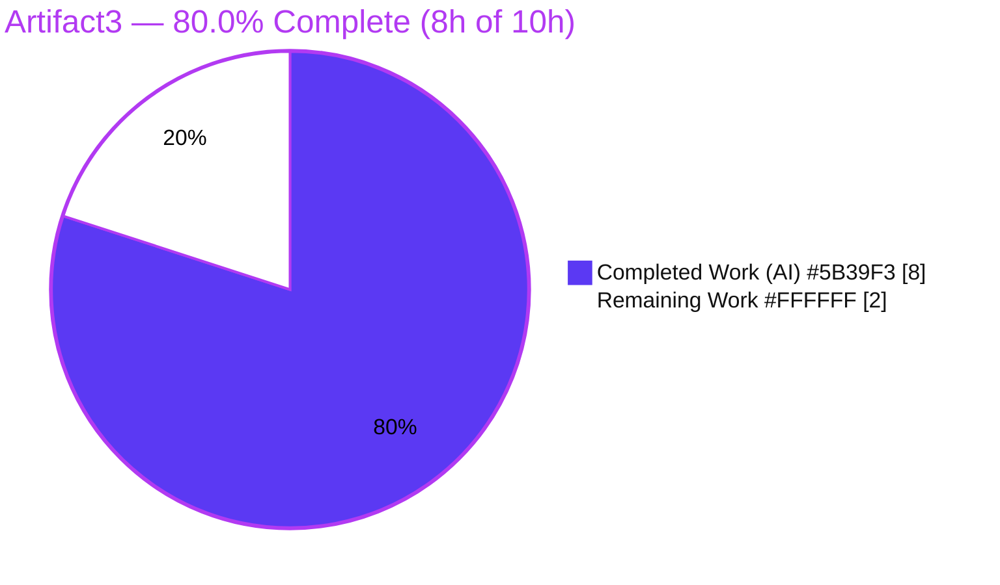
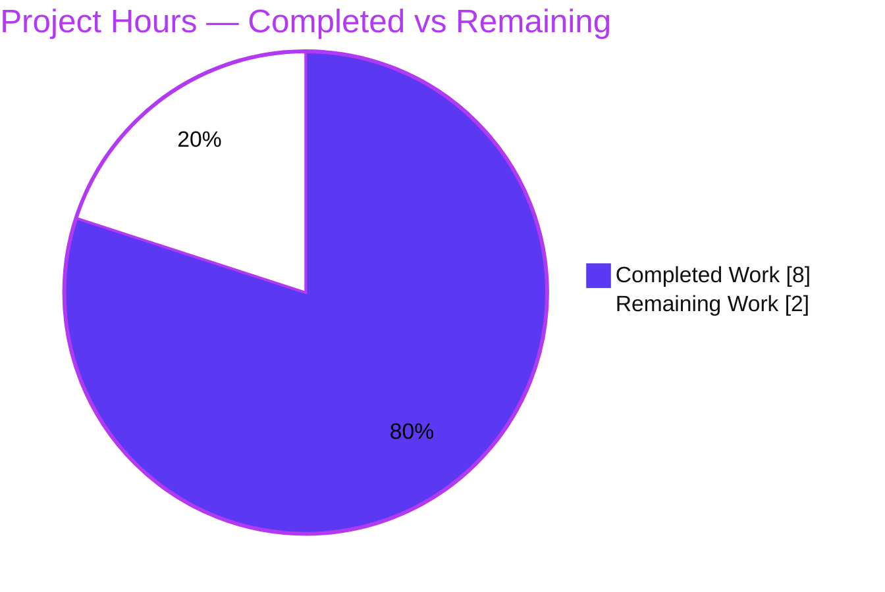

# Blitzy Project Guide — Artifact3 (Node.js + Express 5 Tutorial)

> **Branch:** `blitzy-d498aad1-87eb-46ab-b0cd-536ac803cd25` · **HEAD:** `2f0ff41` · **Base:** `82a5d04`
> **Status legend / brand colors:** Completed / AI Work = Dark Blue `#5B39F3` · Remaining = White `#FFFFFF` · Headings & Accents = Violet-Black `#B23AF2` · Highlights = Mint `#A8FDD9`

---

## 1. Executive Summary

### 1.1 Project Overview

Artifact3 is a minimal Node.js tutorial that adopts the **Express.js (v5)** web framework to expose two read-only, plain-text HTTP `GET` endpoints: `GET /` returning `Hello world` and `GET /good-evening` returning `Good evening`. The target audience is developers learning Express fundamentals. The repository began as a single-file scaffold (only `README.md` containing `# Artifact3`), so this work **bootstraps the entire Express foundation** — manifest, lockfile, application entry point, ignore rules, and documentation — rather than refactoring existing code. Technical scope is intentionally small and self-contained: one direct dependency (`express ^5.2.1`), CommonJS modules, and twelve-factor `PORT` configuration. Business impact is educational/illustrative rather than operational.

### 1.2 Completion Status



| Metric | Hours |
|---|---|
| **Total Hours** | **10** |
| **Completed Hours (AI + Manual)** | **8** (8 AI + 0 Manual) |
| **Remaining Hours** | **2** |
| **Percent Complete** | **80.0%** |

> Completion is computed per the AAP-scoped hours methodology: `Completed (8) / Total (10) × 100 = 80.0%`. All completed hours were delivered autonomously by Blitzy agents; no manual human hours have been logged yet.

### 1.3 Key Accomplishments

- ✅ **Express 5.2.1 adopted** as the sole direct dependency, declared in `package.json` and pinned in `package-lock.json`.
- ✅ **`server.js` entry point** instantiates the Express app and starts an HTTP listener with an Express-5 error-argument callback.
- ✅ **`GET /` returns exactly `Hello world`** (11 bytes) and **`GET /good-evening` returns exactly `Good evening`** (12 bytes) — verified at runtime.
- ✅ **Reproducible dependency lockfile** — `npm ci` installs 66 packages deterministically with **0 vulnerabilities**.
- ✅ **`.gitignore`** excludes `node_modules/`, `npm-debug.log*`, and `.env`; `node_modules/` confirmed untracked.
- ✅ **README expanded** with prerequisites, install/run commands, an endpoints table, and curl examples — while preserving the `# Artifact3` identity.
- ✅ **All 5 in-scope files committed** by `agent@blitzy.com` across 3 commits; working tree clean.
- ✅ **Autonomous validation passed** all gates: dependencies, compilation (`node --check`), runtime, and security.

### 1.4 Critical Unresolved Issues

| Issue | Impact | Owner | ETA |
|---|---|---|---|
| _None_ | All AAP deliverables are implemented, committed, and validated; the Final Validator reported zero unresolved errors and required zero code modifications. | — | — |

> **No critical unresolved issues identified.** Remaining items are routine human-in-the-loop gates (see §1.6 and §2.2), not defects.

### 1.5 Access Issues

| System / Resource | Type of Access | Issue Description | Resolution Status | Owner |
|---|---|---|---|---|
| _None_ | — | No access issues identified. The npm public registry was reachable during validation (`npm ci` succeeded, 66 packages installed); the repository and branch are accessible; no service credentials or third-party API access are required by this tutorial. | N/A | — |

> **No access issues identified.**

### 1.6 Recommended Next Steps

1. **[High]** Perform human code review of the 5 changed files and **merge the branch to `main`**.
2. **[Medium]** **Confirm the agent's default assumptions** with the requester — route path `/good-evening` and listen port `3000` (the user specified only the response bodies; AAP §0.6.2 flags these as open assumptions).
3. **[Low]** **Verify on the recommended Node 24 LTS runtime** (validation ran on Node 20.20.2; both satisfy `engines.node >= 18`).
4. **[Low]** _(Optional, out of AAP scope)_ If the project graduates beyond a local tutorial, consider security hardening (`helmet`, disable `X-Powered-By`), a `/health` endpoint, and an automated test suite.

---

## 2. Project Hours Breakdown

### 2.1 Completed Work Detail

| Component | Hours | Description |
|---|---:|---|
| `package.json` (project manifest) | 0.5 | Declares `express ^5.2.1`, `start` script (`node server.js`), `main = server.js`, `engines.node >= 18`, MIT license. |
| `package-lock.json` (dependency lockfile) | 0.5 | `npm install` resolving express + 65 transitive deps; pinned to exact versions; reproducible via `npm ci`. |
| `server.js` (Express application) | 2.0 | App instance, `GET /` → `Hello world` and `GET /good-evening` → `Good evening` (exact bodies), `process.env.PORT \|\| 3000`, Express-5 listen callback, comprehensive inline documentation. |
| `.gitignore` (VCS hygiene) | 0.25 | Excludes `node_modules/`, `npm-debug.log*`, `.env`. |
| `README.md` (documentation) | 1.5 | Retains `# Artifact3`; adds description, prerequisites, install/run commands, endpoints table, and curl examples (≈50 lines). |
| Autonomous dependency & compilation validation | 1.0 | `npm ci` reproducible install (66 pkgs, exit 0), `npm audit` (0 vulnerabilities), `node --check server.js` (clean parse). |
| Autonomous runtime & security QA | 2.25 | Endpoint verification (200 + exact bodies/headers), 404 behavior, `PORT` override, 40+ security/adversarial test cases, screenshots, evidence capture. |
| **TOTAL** | **8.0** | |

### 2.2 Remaining Work Detail

| Category | Hours | Priority |
|---|---:|---|
| Code Review & PR Merge to `main` | 1.0 | High |
| Confirm Default Assumptions (route path `/good-evening`, port `3000`) | 0.5 | Medium |
| Node 24 LTS Runtime Verification | 0.5 | Low |
| **TOTAL** | **2.0** | |

> Every remaining item is a path-to-production human gate. Out-of-scope items per AAP §0.2.2 (automated test suite, CI/CD, containerization, auth, hardening middleware) are **excluded** and not counted as remaining work.

### 2.3 Hours Reconciliation & Completion Formula

| Quantity | Value | Source |
|---|---:|---|
| Completed Hours | 8.0 | Sum of §2.1 |
| Remaining Hours | 2.0 | Sum of §2.2 |
| **Total Project Hours** | **10.0** | 8.0 + 2.0 |
| **Completion %** | **80.0%** | 8.0 / 10.0 × 100 |

> **Cross-section integrity:** §1.2 Remaining (2) = §2.2 sum (2) = §7 pie "Remaining Work" (2). §2.1 (8) + §2.2 (2) = §1.2 Total (10). ✔

---

## 3. Test Results

All entries below originate exclusively from Blitzy's autonomous validation and QA logs for this project. No formal unit-test framework (jest/mocha/vitest/supertest) exists or is required — the AAP explicitly places automated test suites out of scope (§0.2.2). The verifications recorded are behavioral, dependency, compilation, and security checks executed autonomously.

| Test Category | Framework / Tool | Total Tests | Passed | Failed | Coverage % | Notes |
|---|---:|---:|---:|---:|---:|---|
| Runtime / Behavioral | Ad-hoc HTTP harness (curl + Node `http`) | 8 | 8 | 0 | N/A | Exact bodies, 200 statuses, `text/html` content-type, 404 on unknown path, 404 on `POST /`. |
| Security & Adversarial | Manual probes + `web_search` corroboration | 40+ | 40+ | 0 | N/A | XSS, SQLi, traversal, proto-pollution, command-injection, CRLF, DoS-shape, header manipulation — all resisted. |
| Dependency Vulnerability | `npm audit` | 66 (pkgs scanned) | 66 | 0 | N/A | 0 vulnerabilities; all packages from registry with SRI integrity hashes. |
| Compilation / Syntax | `node --check server.js` | 1 | 1 | 0 | N/A | Clean parse, exit 0 (re-verified this session). |
| Reproducible Install | `npm ci` | 1 | 1 | 0 | N/A | 66 packages added, exit 0, no tracked files dirtied. |
| **TOTAL** | | **116+** | **116+** | **0** | **N/A** | No failing or blocked tests. |

> **Coverage note:** No coverage instrumentation is present because no automated unit-test suite exists (out of scope). Behavioral coverage of the two endpoints and the default 404 path is effectively complete via the runtime harness.

---

## 4. Runtime Validation & UI Verification

**Runtime health** (server launched via `npm start`, re-verified this session on Node 20.20.2):

- ✅ **Server startup** — `npm start` logs `Server listening on port 3000` in well under one second.
- ✅ **`GET /`** — HTTP `200`, body exactly `Hello world` (Content-Length 11), `Content-Type: text/html; charset=utf-8`.
- ✅ **`GET /good-evening`** — HTTP `200`, body exactly `Good evening` (Content-Length 12).
- ✅ **`GET /<unknown>`** — HTTP `404` (Express default handler, with `Content-Security-Policy: default-src 'none'` and `X-Content-Type-Options: nosniff`).
- ✅ **Genuine Express confirmed** — response header `X-Powered-By: Express` (no native `http` fallback).
- ✅ **Port override** — `PORT=8080 npm start` serves both endpoints on 8080 (`Server listening on port 8080`).
- ✅ **Graceful shutdown** — `SIGTERM`/`kill` releases the port; no lingering processes; tracked tree remains clean.

**API integration:** ✅ Not applicable beyond the two internal routes — there are no external services, databases, or third-party APIs in scope.

**UI verification:** ⚠ **Not applicable** — the target is a **headless HTTP server** (AAP §0.3.4), so there is no presentation layer or design system. For completeness, browser rendering was captured: navigating to `/` displays `Hello world` and `/good-evening` displays `Good evening` as raw plain text in the default browser style (consistent with `res.send()` setting `text/html`). ✅ Rendering matches expectations.

---

## 5. Compliance & Quality Review

Cross-mapping of AAP deliverables to quality/compliance benchmarks. **Fixes applied during autonomous validation: none** — every in-scope file was already complete and correct (zero code modifications required).

| # | AAP Requirement / Benchmark | Status | Progress | Verified By |
|---|---|---|---|---|
| 1 | `express ^5.2.1` as sole direct dependency | ✅ Pass | 100% | `package.json` + lockfile (5.2.1); `npm ls express` |
| 2 | `package-lock.json` pins express + transitive deps | ✅ Pass | 100% | lockfileVersion 3; 66 pkgs; `npm ci` reproducible |
| 3 | `server.js` Express entry point + `app.listen()` | ✅ Pass | 100% | Source review; `Server listening on port 3000` |
| 4 | `GET /` → exact `Hello world` | ✅ Pass | 100% | Runtime 200, Content-Length 11; screenshot |
| 5 | `GET /good-evening` → exact `Good evening` | ✅ Pass | 100% | Runtime 200, Content-Length 12; screenshot |
| 6 | `.gitignore` excludes node_modules/, npm-debug.log*, .env | ✅ Pass | 100% | File content; `git check-ignore node_modules/` |
| 7 | `start` script = `node server.js`; `main` = `server.js`; `engines.node >= 18` | ✅ Pass | 100% | `package.json` review |
| 8 | Port externalized via `process.env.PORT \|\| 3000` | ✅ Pass | 100% | `server.js`; `PORT=8080` override log |
| 9 | CommonJS modules (`require`), no native `http` fallback | ✅ Pass | 100% | `require('express')`; `X-Powered-By: Express` |
| 10 | README documents setup + endpoints; `# Artifact3` retained | ✅ Pass | 100% | README review (11/11 cross-checks) |
| 11 | Runnable & self-contained (`npm install` → `npm start`) | ✅ Pass | 100% | End-to-end smoke test |
| 12 | Zero-placeholder / production-ready code | ✅ Pass | 100% | No TODO/FIXME/stub; `'use strict'` present |
| 13 | Supply-chain integrity (registry + SRI, no typosquats) | ✅ Pass | 100% | `npm audit` 0 vulns; 66/66 registry+SRI |
| 14 | Human code review & merge | ⬜ Outstanding | 0% | Pending (human gate) |
| 15 | Confirm default assumptions with requester | ⬜ Outstanding | 0% | Pending (human gate) |

> **Outstanding items (14–15)** are human-in-the-loop gates, not quality defects. The optional `routes/index.js` modular variant was intentionally omitted per the AAP's minimal inline design and is **not** a compliance gap.

---

## 6. Risk Assessment

All risks are **Low severity**, consistent with a two-endpoint, static-text tutorial. Most are deliberate scope decisions (Accepted by design) or already mitigated.

| Risk | Category | Severity | Probability | Mitigation | Status |
|---|---|---|---|---|---|
| Runtime version drift — validated on Node 20.20.2 vs AAP-recommended Node 24 LTS | Technical | Low | Low | `engines.node >= 18` enforced; verify on Node 24 LTS before production | Open (minor) |
| No automated regression test suite | Technical | Low | Medium | Out of AAP scope; README curl checks + 40+ autonomous QA cases; add `supertest` if scope grows | Accepted (by design) |
| Express 5 is a recent major version | Technical | Low | Low | Two literal routes use stable `app.get`/`res.send` (unchanged in v5); runtime verified | Mitigated |
| `X-Powered-By: Express` header disclosure | Security | Low | Low | `app.disable('x-powered-by')` or `helmet` (out of scope) | Accepted (by design) |
| No hardening middleware; security headers absent on 200s | Security | Low | Low | `helmet` if publicly exposed; 404/error responses already carry CSP + nosniff | Accepted (by design) |
| `res.send(string)` yields `text/html` not `text/plain` | Security | Low | Low | No user input reflected → no XSS vector (static bodies) | Accepted (no risk) |
| No process manager / auto-restart on crash | Operational | Low | Low | Use pm2/systemd/container for real deployment (out of scope) | Accepted (by design) |
| No health-check endpoint / structured logging / monitoring | Operational | Low | Low | Add `/health` + logging if deployed beyond tutorial (out of scope) | Accepted (by design) |
| Port 3000 conflict on startup (`EADDRINUSE`) | Operational | Low | Low | `PORT` env override documented (`PORT=8080 npm start`) | Mitigated |
| npm registry availability for install | Integration | Low | Low | Committed `package-lock.json` → reproducible `npm ci`; `node_modules/` present | Mitigated |
| Unconfirmed default assumptions (route path, port) | Integration | Low | Medium | Confirm with requester; trivially adjustable (AAP §0.6.2) | Open (minor) |

> **Dependency security:** `npm audit` reports **0 vulnerabilities** across all 66 packages; every package resolves to the public registry with a sha512 integrity hash — the supply chain is clean.

---

## 7. Visual Project Status

**Project hours breakdown** (Completed = Dark Blue `#5B39F3`, Remaining = White `#FFFFFF`):



**Remaining hours by category / priority** (totals to 2.0h — matches §1.2 and §2.2):

| Category | Priority | Hours | Bar |
|---|---|---:|---|
| Code Review & PR Merge | High | 1.0 | ██████████ |
| Confirm Default Assumptions | Medium | 0.5 | █████ |
| Node 24 LTS Verification | Low | 0.5 | █████ |
| **Total** | | **2.0** | |

> **Integrity check:** Pie "Remaining Work" (2) = §1.2 Remaining Hours (2) = §2.2 Hours sum (2). ✔

---

## 8. Summary & Recommendations

**Achievements.** The Artifact3 repository has been transformed from an empty scaffold (`README.md` only) into a complete, runnable Node.js + Express 5 tutorial. All five in-scope files were created/updated, committed by `agent@blitzy.com`, and validated end-to-end. Both required endpoints return their exact bodies (`Hello world`, `Good evening`), the dependency tree is reproducible and free of known vulnerabilities, and the code is production-ready for its intended scope with zero placeholders.

**Remaining gaps.** The project is **80.0% complete (8h of 10h)**. The outstanding **2 hours are entirely human-in-the-loop, path-to-production gates** — code review and merge, confirmation of the agent's default assumptions (route path `/good-evening` and port `3000`), and an optional verification on the AAP-recommended Node 24 LTS runtime. There is **no unfinished engineering work**.

**Critical path to production.** (1) Human code review → (2) merge to `main` → (3) confirm default assumptions with the requester → (4) optional Node 24 LTS verification. Estimated wall-clock: ~2 hours.

**Success metrics.**

| Metric | Target | Actual |
|---|---|---|
| Endpoints functional | 2/2 | ✅ 2/2 (exact bodies, 200) |
| Dependency vulnerabilities | 0 | ✅ 0 (66 pkgs) |
| Compilation errors | 0 | ✅ 0 (`node --check`) |
| In-scope files delivered | 5/5 | ✅ 5/5 committed |
| Autonomous test pass rate | 100% | ✅ 100% (116+ checks) |

**Production-readiness assessment.** For its intended scope — a **local educational tutorial** — the project is **production-ready** pending human review/merge. The Final Validator and QA agent both returned a PRODUCTION-READY verdict with zero unresolved issues. If the project were to graduate to a publicly exposed service, the out-of-scope hardening items noted in §1.6 and §6 (helmet, monitoring, process management, automated tests) should be revisited — but these are explicitly excluded by the current AAP.

---

## 9. Development Guide

> All commands below were executed successfully during validation. Run them from the repository root.

### 9.1 System Prerequisites

- **Node.js `>= 18`** (Express 5 requirement). **Node.js 24 LTS** is the recommended runtime. _(Validated on Node `v20.20.2`.)_
- **npm** (bundled with Node.js). _(Validated on npm `11.1.0`.)_
- **Disk:** ~5 MB for `node_modules/`. **OS:** any (Linux/macOS/Windows).
- Verify your toolchain:
  ```bash
  node --version   # expect >= v18 (v24 LTS recommended)
  npm --version
  ```

### 9.2 Environment Setup

- **No `.env` file is required** — the app needs no secrets or external configuration.
- **Optional:** override the listen port with the `PORT` environment variable (defaults to `3000`).
- The project uses **CommonJS** modules and has **no build/transpile step**.

### 9.3 Dependency Installation

```bash
# Preferred: reproducible install from the committed lockfile
npm ci

# Alternative (also valid):
npm install
```

Expected: `added 66 packages` and `found 0 vulnerabilities`. Confirm Express resolved correctly:

```bash
npm ls express
# artifact3@1.0.0 <path>
# └── express@5.2.1
```

### 9.4 Application Startup

```bash
# Start on the default port (3000)
npm start
# > artifact3@1.0.0 start
# > node server.js
# Server listening on port 3000

# Start on a custom port
PORT=8080 npm start
# Server listening on port 8080
```

_(Equivalent: `node server.js`.)_ Stop the server with `Ctrl+C` (sends `SIGTERM`, releasing the port).

### 9.5 Verification

With the server running on port 3000:

```bash
curl http://localhost:3000/
# Hello world

curl http://localhost:3000/good-evening
# Good evening

curl -i http://localhost:3000/        # expect HTTP/1.1 200 OK + "X-Powered-By: Express"
curl -o /dev/null -w '%{http_code}\n' http://localhost:3000/unknown   # expect 404
```

### 9.6 Example Usage (browser)

Open `http://localhost:3000/` → the page displays `Hello world`. Open `http://localhost:3000/good-evening` → the page displays `Good evening`. (Plain text rendered in the default browser style.)

### 9.7 Troubleshooting

| Symptom | Likely Cause | Resolution |
|---|---|---|
| `Error: listen EADDRINUSE :::3000` | Port 3000 already in use | Start on another port: `PORT=8080 npm start` |
| `Error: Cannot find module 'express'` | Dependencies not installed | Run `npm ci` (or `npm install`) |
| `engine "node" is incompatible` | Node.js < 18 | Upgrade to Node 18+ (24 LTS recommended) |
| `404` on `/` | Server not running / wrong port | Confirm `npm start` is running and the port matches |
| No output / hang | Server started in foreground | This is expected; the process stays attached and logs to stdout |

---

## 10. Appendices

### A. Command Reference

| Command | Purpose |
|---|---|
| `npm ci` | Reproducible dependency install from `package-lock.json` |
| `npm install` | Install/refresh dependencies (updates lockfile if needed) |
| `npm start` | Start the server (`node server.js`) |
| `PORT=8080 npm start` | Start on a custom port |
| `node --check server.js` | Syntax/parse check (no execution) |
| `npm audit` | Vulnerability scan of the dependency tree |
| `npm ls express` | Confirm the resolved Express version |
| `curl http://localhost:3000/` | Exercise the `Hello world` endpoint |
| `curl http://localhost:3000/good-evening` | Exercise the `Good evening` endpoint |

### B. Port Reference

| Port | Usage | Configurable |
|---|---|---|
| `3000` | Default HTTP listen port | Yes — via `PORT` env var |
| `8080` | Example override (validated) | Yes |

### C. Key File Locations

| Path | Role |
|---|---|
| `server.js` | Express application entry point (both routes + `app.listen`) |
| `package.json` | Manifest: dependency, scripts, `main`, `engines` |
| `package-lock.json` | Pinned dependency lockfile (express 5.2.1 + 65 transitive) |
| `.gitignore` | Excludes `node_modules/`, `npm-debug.log*`, `.env` |
| `README.md` | Setup & endpoint documentation |
| `node_modules/` | Installed dependencies (git-ignored) |

### D. Technology Versions

| Technology | Version | Notes |
|---|---|---|
| express | `5.2.1` | Sole direct dependency (declared `^5.2.1`) |
| Node.js | `>= 18` required; `24 LTS` recommended | Validated on `v20.20.2` |
| npm | — | Validated on `11.1.0` |
| Lockfile | `lockfileVersion 3` | 66 total packages |
| Module system | CommonJS | No `"type": "module"` |

### E. Environment Variable Reference

| Variable | Default | Required | Description |
|---|---|---|---|
| `PORT` | `3000` | No | TCP port the HTTP server listens on |

> No other environment variables are used. No `.env` file is required.

### F. Developer Tools Guide

| Tool | Use |
|---|---|
| `node --check` | Static syntax verification of `server.js` |
| `npm audit` / `npm audit --json` | Dependency vulnerability scanning |
| `npm ls --all` | Inspect the full dependency tree |
| `curl -i` / `curl -I` | Inspect response bodies, status codes, and headers |
| QA evidence (`blitzy/qa_evidence/`) | Captured headers, audit output, server logs, security report |
| Screenshots (`blitzy/screenshots/`) | Browser renderings of both endpoints |

### G. Glossary

| Term | Definition |
|---|---|
| **AAP** | Agent Action Plan — the authoritative specification of project scope. |
| **CommonJS** | Node's default module system using `require`/`module.exports`. |
| **Twelve-factor config** | Externalizing configuration (e.g., port) via environment variables. |
| **`res.send()`** | Express response method; for a string, sets `text/html` and writes the body verbatim. |
| **SRI** | Subresource Integrity — sha512 hashes pinning each package in the lockfile. |
| **Path-to-production gate** | A human-in-the-loop step (review, merge, confirmation) required before release. |
| **Greenfield bootstrap** | Building a project's foundation from scratch (no legacy code to refactor). |